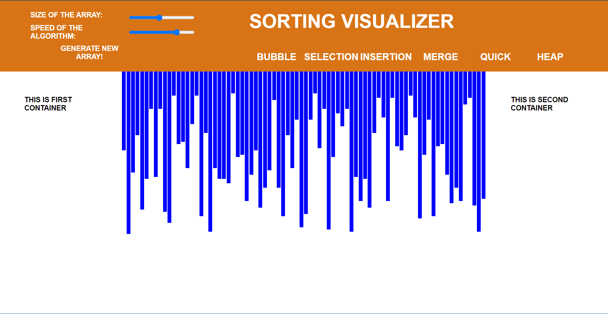
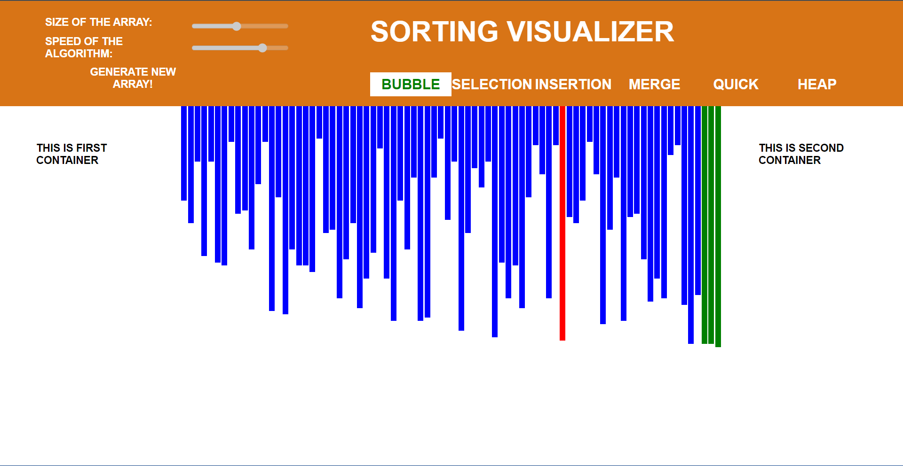
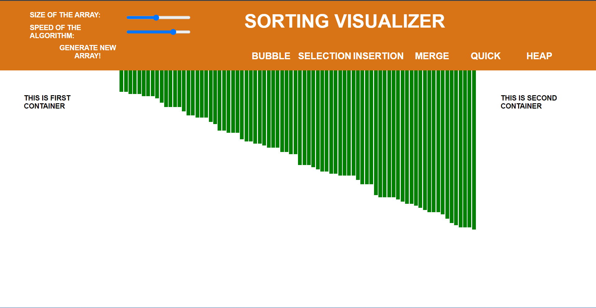

<h1 align="center"> Sorting Visualizer </h1>

A Web Based sorting visualizer tool that can be used to sort elements in a best way possible with animations and here user also get option to set speed of the visualizer and the size of elements. Here user provided with many ways to sort elements like using Bubble sort, Selection sort, Insertion sort, Merge sort, Quick sort and Heap sort.
 

Technology Used :
 
 

  HTML 
  CSS 
  JavaScript

---

<h2 align="center">°Main Page :</h2>

 

---

<h2 align="center">°Calculation Details :</h2>

 

---

<h2 align="center">°Error if any field left empty :</h2>

